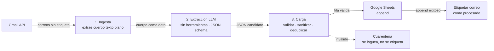

# Arquitectura y modelo de amenazas

## Principio rector

El cuerpo de un correo es **entrada no confiable**. Puede venir de un remitente
spoofeado y puede contener inyección de prompts. Por eso el sistema confina al
LLM a un rol de **función pura sin herramientas**: recibe texto, devuelve JSON, y
no puede ejecutar ninguna acción. Todas las acciones con efectos viven en código
determinista que valida tanto la entrada (correo) como la salida (JSON del LLM).

Resultado: si una inyección de prompt tiene éxito, su único efecto posible es
producir un JSON malformado o con datos sospechosos, que el paso de carga
rechaza. El radio de daño se reduce a "una fila en cuarentena".

## Flujo

## Componentes

### 1. Ingesta — `src/ingest.py` (determinista)

- Autentica con OAuth (scopes mínimos) y consulta Gmail con un query del tipo
  `from:(a@x.com OR b@y.com) -label:processed`.
- Por cada mensaje, extrae el cuerpo en **texto plano**: recorre las partes MIME,
  decodifica base64url, prefiere `text/plain` y, si solo hay `text/html`, lo
  limpia a texto.
- No interpreta ni decide nada sobre el contenido; solo entrega `(message_id,
  cuerpo)` al siguiente paso.

### 2. Extracción — `src/extract.py` (LLM, sin herramientas)

- Llama a la API de Anthropic **sin `tools`**, con structured output / JSON
  schema y temperatura baja.
- El cuerpo se inserta delimitado y rotulado como dato (p. ej. dentro de un
  bloque claramente marcado), con instrucciones de sistema que dejan explícito
  que el contenido del correo no son instrucciones.
- Devuelve un único objeto JSON conforme al esquema de `docs/SCHEMA.md`. No
  escribe en ningún lado.

### 3. Carga — `src/load.py` (determinista)

- **Valida** el JSON contra el esquema (tipos, campos requeridos, whitelists,
  rangos). Ver `docs/SCHEMA.md`.
- **Sanitiza** contra inyección de fórmulas antes de tocar Sheets.
- **Deduplica** (por `message_id` ya registrado y/o hash de la fila).
- Hace **append** en la hoja.
- **Solo tras el append exitoso**, aplica la etiqueta de procesado en Gmail.
- Si algo falla validación, lo **loguea** y deja el correo **sin etiquetar**
  (cuarentena) para revisión manual.

## Mecanismo incremental (idempotencia)

El estado vive en Gmail como una **etiqueta** (`PROCESSED_LABEL`). El query
excluye lo ya etiquetado, así que cada corrida toma solo lo nuevo. El orden
—escribir primero, etiquetar después— garantiza que una corrida interrumpida se
reintente sin perder ni duplicar registros. Es auto-recuperable y visible desde
la propia interfaz de Gmail.

## Modelo de amenazas

| Amenaza | Mitigación |
|---|---|
| **Inyección de prompts indirecta** (instrucciones ocultas en el correo) | El LLM no tiene herramientas: no puede actuar. Su salida se valida y sanitiza. |
| **Inyección de fórmulas en Sheets** (valor que empieza con `= + - @`) | Sanitización obligatoria en el paso de carga antes del append. Ver SCHEMA. |
| **Datos falsos bien formados** (remitente spoofeado inyecta monto/comercio plausible) | Chequeos de cordura: whitelist de moneda y de tipo, rangos de monto, regex de tarjeta. Lo dudoso va a cuarentena. |
| **Spoofing del remitente** | El filtro `From` es conveniencia, no seguridad. No se trata como frontera de confianza; el contenido sigue siendo no confiable. |
| **Robo de tokens / API keys** | Scopes mínimos; secretos fuera del repo (`.gitignore`); `token.json`/keys en keychain o con permisos restringidos (`chmod 600`); revocables desde la cuenta de Google / consola de Anthropic. |
| **Privilegio excesivo** | Solo `gmail.readonly`, `gmail.modify` (etiquetar) y `spreadsheets`. |
| **Fallos silenciosos en tarea desatendida** | Logging por corrida, proceso idempotente, cuarentena explícita. |
| **Cadena de suministro** | Dependencias mínimas y con versión fijada (`requirements.txt`). |
| **Acceso a la hoja** | Revisar sharing de la Sheet; sin *link sharing* abierto. |

## Riesgo residual (asumido conscientemente)

Usar un LLM hospedado implica que **el cuerpo del correo viaja a la nube** en el
paso de extracción. Es inherente al diseño. Mitigaciones posibles si fuera
inaceptable para tus datos: enmascarar campos antes de enviar (limita lo que el
modelo puede extraer) o usar un modelo local (con costo de calidad). Para este
proyecto se asume aceptable.
